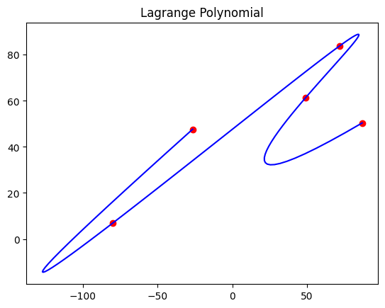

```python
import numpy as np
import scipy.interpolate
import matplotlib.pyplot as plt

#generate random points of range -100 t0 100
xArr = np.random.uniform(-100, 100, 5)
yArr = np.random.uniform(-100, 100, 5)


plt.figure()
u = plt.plot(xArr,yArr,'ro')
t = np.linspace(0, 1, len(xArr)) 


# implement lagrange polynomial
xpl = scipy.interpolate.lagrange(t, xArr)
ypl = scipy.interpolate.lagrange(t, yArr)
n = 100
kspace = np.linspace(t[0],t[-1],n)
xLagrange = xpl(kspace)
yLagrange = ypl(kspace)

#draw plot of polynomial
plt.plot(xLagrange, yLagrange,'b-',label = "Polynomial")
plt.title("Lagrange Polynomial")
plt.show()

```


    

    

